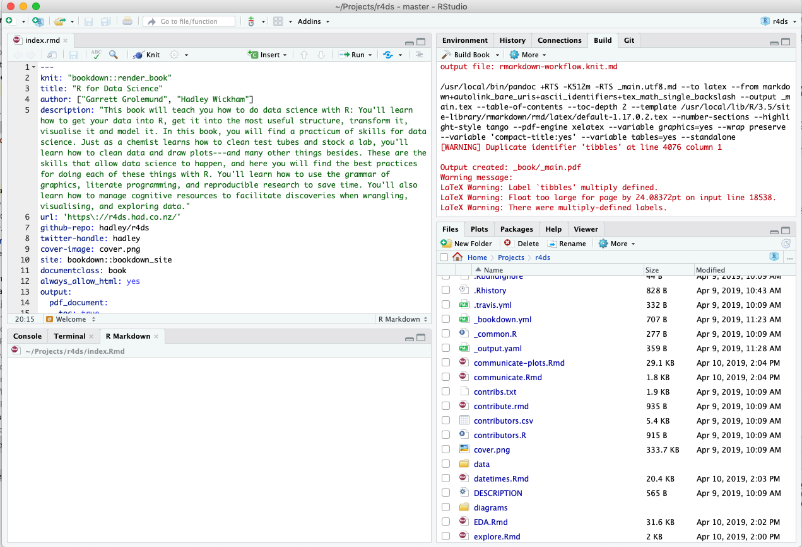

## R markdown convert

Generic toc generation

`python3 converter.py --generate r4ds/_bookdown.yml example`

### Notes

Generation is not from `.rmd` files, we use prepared markdown files from R-Studio(during pdf generation)

Required files:
1. `_bookdown.yml`
1. `_book` (contains .md files)
1. `_bookdown_files`
1. required assets if included

Where are a lot of graphics in pdf format, see PDF to JPG section in main documentation
Also it contains `.grapfile` files, we do not convert it in automatic way, need to user attention 

Not all features from latex supported, because different formats

## Book generation

As we placed config to `example` directory, a book content could be generated by command

`python3 converter.py example`

Generated content will be placed to `example/generate` folder
